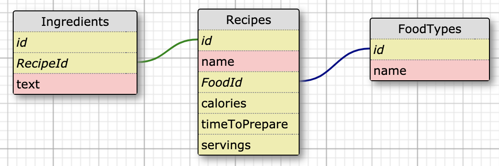

# Receipe Microservice (part of the [Quantified Self Project](https://github.com/ryanmillergm/quantified_self))
This API has several endpoints for a user to query a database of **food types**, **recipes**, and **ingredients**. All responses are JSON. Users can search for recipes based on a food type (for example, `pizza` or `chicken`), range of calories (for example, `100-300`), or number of ingredients. The database is seeded based on the top 10 recipes for 4 food types (chicken, pizza, burger, muffin) from the Edamam API.

The microservice is deployed at https://recipe-microservice.herokuapp.com/.

This project was part of [Turing School of Software & Design](https://turing.io)'s Back End Engineering program (Mod 4). See the project spec [here](https://backend.turing.io/module4/projects/quantified_self/qs_server_side). It was completed in 10 days by [Alexandra Chakeres](https://github.com/chakeresa) and [Ryan Miller](https://github.com/ryanmillergm).

View the project board at https://github.com/chakeresa/recipe_microservice/projects/1.

## Schema


## Tech Stack
 - Framework: Express v4.16.4
 - Language: JavaScript
 - Database: PostgreSQL v7.12.1
 - ORM: Sequelize v5.15.1
 - Testing: Mocha v6.2.0 & Chai v4.2.0
 - Seed data: Edamam recipe search API

## Other Packages
 - Secure ENV variable storage: dotenv
 - Run server using latest file updates: nodemon
 - Run shell commands: shelljs
 - Make HTTP requests in tests: supertest
 - Test coverage: nyc (Istanbul)
 - Make external API calls: request & request-promise

## Local Setup
 - `$ git clone git@github.com:chakeresa/recipe_microservice.git`
 - `$ cd recipe_microservice`
 - `$ createuser postgres -d`
 - `$ npm install`
 - `$ npx sequelize db:create`
 - `$ npx sequelize db:migrate`
 - `$ node ./util/seedScript.js`

## Running the Server Locally
 - `$ npm start` or `$ nodemon`
 - Access endpoints at `http://localhost:3000`

## Running the Test Suite
 - `$ npm test`

## API Endpoints
### Return **all** recipe objects and their ingredients
Request:
```
GET /api/v1/recipes
Accept: application/json
```
Example response:
```
Status: 200
Content-Type: application/json
Body:
[
  {
    "id": 1,
    "name": "Chicken Soup",
    "calories": 300,
    "timeToPrepare": 90,
    "servings": 4,
    "ingredients": [
      {
        "id": 1,
        "text": "5 cups chicken stock"
      },
      {
        "id": 2,
        "text": "1/2 cup celery"
      }
    ]
  },
  {
    "id": 2,
    "name": "Chicken Parmesan",
    "calories": 400,
    "timeToPrepare": 60,
    "servings": 2,
    "ingredients": [
    ]
  }
]
```

### Return all recipe objects that are associated with a particular food type
Request:
```
GET /api/v1/recipes/food_search?q=FOOD_TYPE
Accept: application/json
```
Example successful response:
```
Status: 200
Content-Type: application/json
Body:
[
  {
    "id": 1,
    "name": "Chicken Soup",
    "calories": 300,
    "timeToPrepare": 90,
    "servings": 4,
    "ingredients": [
      {
        "id": 1,
        "text": "5 cups chicken stock"
      },
      {
        "id": 2,
        "text": "1/2 cup celery"
      }
    ]
  },
  {
    "id": 3,
    "name": "Chicken Parmesan",
    "calories": 400,
    "timeToPrepare": 60,
    "servings": 2,
    "ingredients": [
    ]
  }
]
```
Failed response (if no food type given for `q` query params):
```
Status: 400
Content-Type: application/json
Body:
{ 'error': 'Food type must be provided as a "q" query param' }
```

### Return all recipe objects that are within a particular calorie range
Example Request:
```
GET /api/v1/recipes/calories_search?q=100-300
Accept: application/json
```
Example successful response:
```
Status: 200
Content-Type: application/json
Body:
[
  {
    "id": 1,
    "name": "Chicken Soup",
    "calories": 300,
    "timeToPrepare": 90,
    "servings": 4,
    "ingredients": [
      {
        "id": 1,
        "text": "5 cups chicken stock"
      },
      {
        "id": 2,
        "text": "1/2 cup celery"
      }
    ]
  },
  {
    "id": 3,
    "name": "Chicken Parmesan",
    "calories": 150,
    "timeToPrepare": 60,
    "servings": 1,
    "ingredients": [
    ]
  }
]
```
Failed response (if `q` query params are not two numbers separated by a dash):
```
Status: 400
Content-Type: application/json
Body:
{ 'error': 'A numerical range of calories must be provided as a "q" query param (separated by a dash)' }
```

### Return all recipes with a particular number of ingredients
Request:
```
GET /api/v1/recipes/ingredient_search?q=2
Accept: application/json
```
Example response:
```
Status: 200
Content-Type: application/json
Body:
[
  {
    id: 1,
    name: 'Chicken Soup',
    calories: 300,
    timeToPrepare: 90,
    servings: 4,
    ingredients: [
      {
        id: 1,
        text: '5 cups chicken stock'
      },
      {
        id: 2,
        text: '1/2 cup celery'
      }
    ]
  },
  {
    id: 2,
    name: 'Chicken Parmesan',
    calories: 150,
    timeToPrepare: 60,
    servings: 2,
    ingredients: [
      {
        id: 3,
        text: '2 chicken breasts'
      },
      {
        id: 4,
        text: '3/4 cup shredded parmesan'
      }
    ]
  }
]
```
Failed response (if no number of ingredients is given for 'q' query params):
```
Status: 400
Content-Type: application/json
Body:
{ error: 'Number of ingredients must be provided as a "q" query param' }
```

### Return all recipes in order of time it takes to prepare
Example request (can sort `ASC` or `DESC`):
```
GET `/api/v1/recipes/time_search?sort=ASC`
Accept: application/json
```
Example response:
```
Status: 200
Content-Type: application/json
Body:
[
  {
    id: 2,
    name: 'Top Ramen',
    calories: 300,
    timeToPrepare: 15,
    servings: 4,
    ingredients: [
      {
        id: 3,
        text: '1 pack Top Ramen'
      },
      {
        id: 4,
        text: '2 cups water'
      }
    ]
  },
  {
    id: 3,
    name: 'Chicken Parmesan',
    calories: 150,
    timeToPrepare: 30,
    servings: 2,
    ingredients: [
      {
        id: 5,
        text: '2 chicken breasts'
      },
      {
        id: 6,
        text: '3/4 cup shredded parmesan'
      }
    ]
  },
  {
    id: 1,
    name: 'Lasagna',
    calories: 1200,
    timeToPrepare: 180,
    servings: 2,
    ingredients: [
      {
        id: 1,
        text: '4 lasagna pasta'
      },
      {
        id: 2,
        text: '4 cups marinara sauce'
      }
    ]
  }
]
```
Failed response(if query parameter is not 'ASC' or 'DESC'):
```
Status: 400
Content-Type: application/json
Body:
{ 'error': "Sort param must be 'ASC' or 'DESC'" }
```

## Known Issues
 - Potential to optimize query by number of ingredients (currently using forEach instead of an SQL query)

## Core Contributors
 - Alexandra Chakeres, [@chakeresa](https://github.com/chakeresa)
 - Ryan Miller, [@ryanmillergm](https://github.com/ryanmillergm)

### How to Contribute
 - Fork and clone the [repo](https://github.com/chakeresa/recipe_microservice)
 - Make changes on your fork & push them to GitHub
 - Visit https://github.com/chakeresa/recipe_microservice/pulls and click `New pull request`
